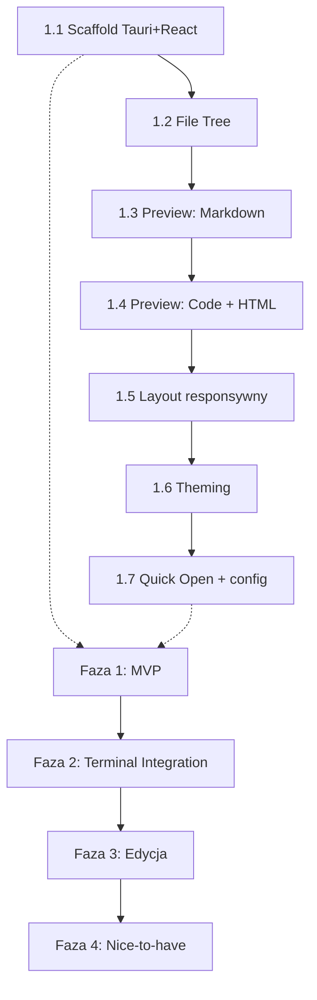

# Glance - Lekki File Viewer dla Linux

> Minimalistyczna przeglądarka plików zintegrowana z terminalem.
> Robocza nazwa: **Glance** (szybki rzut oka na pliki).

---

## Problem

Praca z Claude Code w terminalu (Yakuake) wymaga podglądu na pliki, które AI tworzy/edytuje. VSCode jest za ciężki na sam podgląd. Obsidian nie pokazuje .txt i innych plików. Brakuje lekkiego narzędzia, które:
- Pokazuje drzewo plików z wyróżnieniem ostatnich zmian
- Renderuje Markdown z diagramami Mermaid
- Daje podgląd kodu z kolorowaniem składni
- Śledzi aktywny folder terminala

---

## Decyzje technologiczne

| Aspekt | Wybór | Uzasadnienie |
|--------|-------|--------------|
| Framework | **Tauri v2** | 5-10x lżejszy od Electrona (~10MB vs ~150MB), systemowy WebView |
| Frontend | **React + TypeScript** | Stack który się uczysz, bogaty ekosystem |
| Markdown | **react-markdown + remark-gfm** | Modułowe, dojrzałe, GFM (tabele, checkboxy) |
| Mermaid | **mermaid.js** (bezpośrednio) | Renderowanie diagramów w Markdown preview |
| Syntax highlighting | **Shiki** | Tematy VSCode (TextMate), wysoka jakość kolorowania |
| Drzewo plików | **react-arborist** | Wirtualizacja, wydajne dla tysięcy plików |
| Edytor (lekki) | **CodeMirror 6** | ~300KB, modularny, wystarczający do lekkiej edycji |
| File watching | **tauri-plugin-fs-watch** | inotify na Linuxie, plugin Tauri |
| Styling | **Tailwind CSS** | Szybkie prototypowanie, łatwe theming |
| State management | **Zustand** | Lekki, prosty, bez boilerplate |

### Zależności systemowe (Arch Linux)

Build: `webkit2gtk`, `gtk3`, `base-devel`, `rust`, `nodejs`
Runtime: `webkit2gtk`, `gtk3`

---

## Architektura

```
┌─────────────────────────────────────────────┐
│                  Tauri (Rust)                │
│  ┌─────────────┐  ┌──────────────────────┐  │
│  │ File System  │  │ Terminal Integration │  │
│  │ - read files │  │ - detect Yakuake CWD │  │
│  │ - watch dirs │  │ - /proc/[pid]/cwd    │  │
│  │ - file meta  │  │                      │  │
│  └─────────────┘  └──────────────────────┘  │
├─────────────────────────────────────────────┤
│              React Frontend (TS)            │
│  ┌──────────┐  ┌────────────────────────┐   │
│  │ File Tree │  │     Preview Panel     │   │
│  │ (sidebar) │  │ - Markdown + Mermaid  │   │
│  │           │  │ - Code + syntax       │   │
│  │ Sortable  │  │ - HTML rendered/raw   │   │
│  │ Filtrable │  │ - Images (PNG/SVG)    │   │
│  │ Watchable │  │ - Plain text          │   │
│  └──────────┘  └────────────────────────┘   │
└─────────────────────────────────────────────┘
```

---

## Funkcjonalności

### MVP (Faza 1)

#### 1.1 Drzewo plików
- [x] Wyświetlanie struktury folderów i plików
- [x] Ikony wg typu pliku (folder, .md, .ts, .py, .json, etc.)
- [x] Rozwijanie/zwijanie folderów
- [x] Kliknięcie otwiera podgląd w panelu obok
- [x] Wyróżnienie ostatnio zmienionych plików (kolorowa kropka/pogrubienie + timestamp)
- [x] Filtr/toggle "pokaż tylko zmienione" (w ostatnich N minutach - konfigurowalny)
- [x] Ukrywanie plików/folderów wg wzorców (node_modules, .git, etc.)
- [x] Sortowanie: po nazwie / po dacie modyfikacji

#### 1.2 Podgląd plików
- [x] **Markdown**: renderowany preview (domyślnie) z przełączeniem na source
  - GFM: tabele, checkboxy, strikethrough
  - Diagramy Mermaid (renderowane inline)
  - Syntax highlighting w blokach kodu
- [x] **Kod** (.ts, .js, .py, .json, .yaml, .toml, etc.): Shiki syntax highlighting
- [x] **HTML**: renderowany podgląd (iframe/sandbox) z przełączeniem na source
- [x] **Pliki tekstowe** (.txt, .log, .env, .gitignore, etc.): plain text z numerami linii
- [x] **JSON**: sformatowany z kolorowaniem + collapsible sections

#### 1.3 Nawigacja
- [x] Ręczne wskazywanie folderu (open folder dialog)
- [x] Breadcrumb path na górze
- [x] Ctrl+P: szybkie wyszukiwanie pliku po nazwie (fuzzy search)

#### 1.4 Layout
- [x] Responsywny: drzewo po lewej + podgląd po prawej (ekran poziomy)
- [ ] Alternatywny: drzewo na górze + podgląd na dole (ekran pionowy)
- [ ] Przełączanie layoutu ręczne + auto-detect wg proporcji okna
- [x] Resizable splitter między panelami

#### 1.5 Theming
- [x] Dark mode (domyślny)
- [x] Light mode
- [ ] Customizacja: kolory accent, font, rozmiar czcionki
- [x] Zapisywanie preferencji w pliku konfiguracyjnym (localStorage via zustand persist)
- [ ] Obsługa gotowych motywów (Catppuccin, Tokyo Night, Dracula, Nord, etc.)
- [ ] Import motywu z pliku JSON (custom community themes)

### Faza 2: Integracja z terminalem

#### 2.1 Auto-detect CWD
- [ ] Wykrywanie procesu Yakuake (lub innego terminala)
- [ ] Odczyt `/proc/[pid]/cwd` aktywnej sesji
- [ ] Automatyczne przełączanie drzewa plików na aktywny CWD
- [ ] Opcja "pin" - zablokuj na aktualnym folderze (nie podążaj za terminalem)

#### 2.2 File watching
- [ ] Automatyczne odświeżanie drzewa po zmianach na dysku
- [ ] Highlight nowo utworzonych plików (flash animation)
- [ ] Auto-otwarcie podglądu ostatnio zmodyfikowanego pliku (opcjonalnie)

### Faza 3: Lekka edycja

#### 3.1 Edycja Markdown
- [ ] Przełączenie preview -> edit mode (CodeMirror)
- [ ] Toolbar z podstawowym formatowaniem (bold, italic, heading, link, lista)
- [ ] Live preview obok edytora (split view)
- [ ] Zapis: Ctrl+S

#### 3.2 Edycja pozostałych plików
- [ ] CodeMirror z syntax highlighting wg typu pliku
- [ ] Prosty zapis bez auto-formatowania
- [ ] Oznaczenie niezapisanych zmian (dot na tabeli pliku)

### Faza 4: Nice-to-have / Przyszłość

#### 4.1 Podgląd obrazów
- [ ] PNG, JPG, SVG, WebP - renderowane inline
- [ ] Zoom in/out
- [ ] SVG: przełączenie podgląd/source

#### 4.2 Wiele zakładek
- [ ] Otwieranie kilku plików w zakładkach
- [ ] Drag & drop zakładek

#### 4.3 Git integration
- [ ] Wskazanie statusu pliku w drzewie (modified, untracked, staged)
- [ ] Diff view dla zmienionych plików

#### 4.4 Search in files
- [ ] Grep-like wyszukiwanie treści w plikach
- [ ] Wyniki z podglądem kontekstu

#### 4.5 Terminal widget
- [ ] Wbudowany mini-terminal (opcjonalny, wysuwany panel)

---

## Struktura projektu (planowana)

```
glance/
├── src-tauri/               # Rust backend (Tauri)
│   ├── src/
│   │   ├── main.rs          # Entry point
│   │   ├── commands/        # Tauri commands (invoke z frontendu)
│   │   │   ├── fs.rs        # File system operations
│   │   │   ├── terminal.rs  # CWD detection
│   │   │   └── config.rs    # App configuration
│   │   └── lib.rs
│   ├── Cargo.toml
│   └── tauri.conf.json
├── src/                     # React frontend
│   ├── components/
│   │   ├── FileTree/        # Drzewo plików (react-arborist)
│   │   ├── Preview/         # Panel podglądu
│   │   │   ├── MarkdownPreview.tsx
│   │   │   ├── CodePreview.tsx
│   │   │   ├── HtmlPreview.tsx
│   │   │   ├── ImagePreview.tsx
│   │   │   └── PlainTextPreview.tsx
│   │   ├── Editor/          # CodeMirror wrapper
│   │   ├── Layout/          # Responsive layout, splitter
│   │   ├── Toolbar/         # Top bar, breadcrumbs, search
│   │   └── Settings/        # Theme picker, preferences
│   ├── hooks/
│   │   ├── useFileSystem.ts
│   │   ├── useFileWatcher.ts
│   │   ├── useTerminalCwd.ts
│   │   └── useTheme.ts
│   ├── store/               # Zustand store
│   │   ├── fileStore.ts
│   │   └── settingsStore.ts
│   ├── utils/
│   │   ├── fileTypes.ts     # Mapowanie rozszerzeń -> typ podglądu
│   │   └── formatters.ts
│   ├── App.tsx
│   └── main.tsx
├── PLAN.md                  # Ten plik
├── package.json
└── tsconfig.json
```

---

## UI Mockup (ASCII)

### Layout poziomy (szerokie okno)

```
┌────────────────────────────────────────────────────────┐
│  [Pin] 📁 ~/Projects/glance    [🔍 Ctrl+P]  [⚙]  [◐] │
├──────────────┬─────────────────────────────────────────┤
│ 📁 src/      │  README.md                    [Preview] │
│  📁 components│                                        │
│   📄 App.tsx │  # Glance                               │
│   📄 main.tsx│                                         │
│ 📁 src-tauri/│  > Lekki file viewer...                 │
│ ● PLAN.md  2m│                                         │
│ ● README.md 5m│  ## Features                           │
│   .gitignore │  - File tree                            │
│              │  - Markdown preview                      │
│              │  - Mermaid diagrams                      │
│              │                                         │
│ [▼ Zmienione]│  ```mermaid                             │
│              │  graph TD                                │
│              │    A-->B                                  │
│              │  ```                                     │
│              │  [rendered mermaid diagram here]          │
├──────────────┴─────────────────────────────────────────┤
│  src/components/Preview/MarkdownPreview.tsx  Ln 42     │
└────────────────────────────────────────────────────────┘
```

Legenda:
- `●` = ostatnio zmodyfikowany (z timestampem np. "2m" = 2 min temu)
- `[Pin]` = toggle auto-follow terminala
- `[Preview]` = przełącznik preview/source/edit
- `[◐]` = theme toggle
- `[⚙]` = ustawienia
- `[▼ Zmienione]` = filtr "pokaż tylko zmienione"

### Layout pionowy (wąskie okno)

```
┌───────────────────────┐
│ 📁 ~/Projects/glance  │
├───────────────────────┤
│ 📁 src/               │
│ 📁 src-tauri/         │
│ ● PLAN.md          2m │
│ ● README.md        5m │
│   .gitignore          │
├───────────────────────┤
│  README.md  [Preview] │
│                       │
│  # Glance             │
│  > Lekki file viewer  │
│                       │
│  ## Features          │
│  - File tree          │
│  - Markdown preview   │
│                       │
└───────────────────────┘
```

---

## Skróty klawiszowe (planowane)

| Skrót | Akcja |
|-------|-------|
| `Ctrl+P` | Quick open (fuzzy search) |
| `Ctrl+O` | Open folder |
| `Ctrl+E` | Toggle edit mode |
| `Ctrl+S` | Save (w edit mode) |
| `Ctrl+\` | Toggle sidebar (drzewo) |
| `Ctrl+Shift+P` | Przełącz preview/source |
| `Ctrl+D` | Toggle dark/light |
| `Ctrl+,` | Ustawienia |

---

## Konfiguracja użytkownika

Plik: `~/.config/glance/config.json`

```json
{
  "theme": "dark",
  "customColors": {
    "accent": "#7aa2f7",
    "background": "#1a1b26",
    "foreground": "#c0caf5"
  },
  "font": {
    "family": "JetBrains Mono",
    "size": 14
  },
  "fileTree": {
    "hiddenPatterns": ["node_modules", ".git", "__pycache__", "*.pyc"],
    "recentThresholdMinutes": 30,
    "defaultSort": "name"
  },
  "preview": {
    "markdownDefaultMode": "preview",
    "htmlDefaultMode": "rendered",
    "wordWrap": true
  },
  "terminal": {
    "autoDetect": true,
    "terminalProcess": "yakuake"
  },
  "layout": {
    "orientation": "auto",
    "sidebarWidth": 250
  }
}
```

---

## Kolejność wdrażania



### Faza 1 - rozbicie na kroki

1. **Scaffold** - `create-tauri-app` z React+TS template
2. **File tree** - wczytywanie folderu, react-arborist, ikony
3. **Preview: Markdown** - react-markdown + remark-gfm + mermaid
4. **Preview: Code** - Shiki syntax highlighting
5. **Preview: HTML** - iframe sandbox + source toggle
6. **Preview: Plain text/JSON** - numery linii, JSON collapsible
7. **Layout** - responsive, splitter, auto-detect orientation
8. **Theming** - dark/light, customizacja, persystencja
9. **Quick Open** - Ctrl+P, fuzzy search po nazwach plików
10. **Recent files** - wyróżnienie w drzewie + filtr
11. **Config** - zapis/odczyt ~/.config/glance/config.json

---

## Otwarte pytania

- [x] Nazwa aplikacji: **Glance** (zatwierdzona)
- [ ] Czy ikona/logo jest potrzebne na start?
- [ ] Jakie konkretne wzorce plików ukrywać domyślnie?
- [ ] Czy edycja w fazie 3 ma mieć auto-save?
- [ ] Integracja z innymi terminalami poza Yakuake (Konsole, Alacritty, Kitty)?

---

## Bezpieczeństwo

### Od razu (wbudowane w MVP)

1. **HTML preview - sandbox izolacja**
   - `<iframe sandbox="allow-scripts">` - bez `allow-same-origin`, bez `allow-top-navigation`
   - Brak dostępu do Tauri API, plików użytkownika, parent window
   - Treść ładowana przez `srcdoc`, nie przez `src` (brak file:// URL)

2. **Markdown - sanityzacja HTML**
   - react-markdown domyślnie NIE renderuje raw HTML (bezpieczne)
   - Jeśli dodamy `rehype-raw`: obowiązkowy `rehype-sanitize` z whitelistą tagów
   - Blokowane: `<script>`, `<iframe>`, `<object>`, `<embed>`, `on*` atrybuty

3. **Mermaid - sanityzacja inputu**
   - `mermaid.initialize({ securityLevel: 'strict' })` - blokuje HTML w labelach
   - Renderowanie w izolowanym kontenerze (nie w głównym DOM)

4. **Tauri capabilities (scope)**
   - Dostęp do FS ograniczony do folderu wybranego przez użytkownika
   - Brak `allow-all` scope - explicite definiowanie dozwolonych ścieżek
   - Zapis plików (faza 3) tylko w obrębie otwartego folderu

5. **Symlinki**
   - Rozwiązywanie symlinków i sprawdzanie czy cel jest w obrębie scope'u
   - Opcja w ustawieniach: "podążaj za symlinkami" (domyślnie: tak, ale z walidacją)

6. **Config file**
   - Walidacja schematu config.json przy odczycie (zod/ajv)
   - Ignorowanie nieznanych kluczy, fallback na domyślne wartości

### Faza 3 (edycja)

7. **Zapis plików**
   - Walidacja ścieżki zapisu - musi być w obrębie otwartego folderu
   - Brak zapisu do plików systemowych / poza scope
   - Potwierdzenie przed nadpisaniem pliku binarnego

8. **Backup przed edycją**
   - Opcjonalny auto-backup (`.glance-backup`) przed pierwszą edycją pliku w sesji

---

## Notatki techniczne

### Wykrywanie CWD terminala (Linux)
```
1. Znajdź PID procesu Yakuake: pgrep yakuake
2. Znajdź child shells: pgrep -P <yakuake_pid>
3. Dla aktywnego shella: readlink /proc/<shell_pid>/cwd
```
Wymaga: dostęp do /proc (standardowy na Linuxie).

### File watching
Tauri plugin `fs-watch` używa inotify na Linuxie. Trzeba uważać na:
- Limity inotify watches (domyślnie 8192, można zwiększyć)
- Recursive watching dużych folderów (node_modules!)
- Rozwiązanie: watchuj tylko widoczne foldery (rozwinięte w drzewie)

### Renderowanie Mermaid
Mermaid.js renderuje do SVG w runtime. W react-markdown:
1. Wykryj blok kodu z językiem "mermaid"
2. Zamiast syntax highlight, przekaż do mermaid.render()
3. Wstaw wynikowy SVG

### Sandbox dla HTML preview
HTML preview powinien być w `<iframe sandbox="allow-scripts">`:
- Izolacja od głównej aplikacji
- Brak dostępu do Tauri API
- Brak dostępu do plików użytkownika
